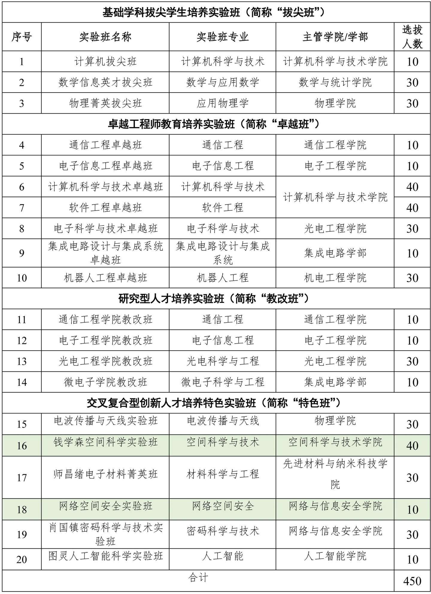
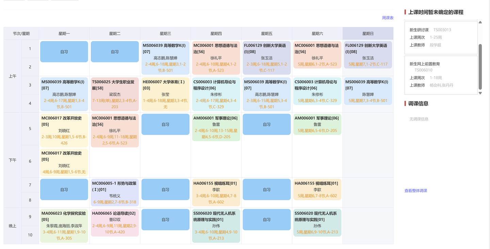
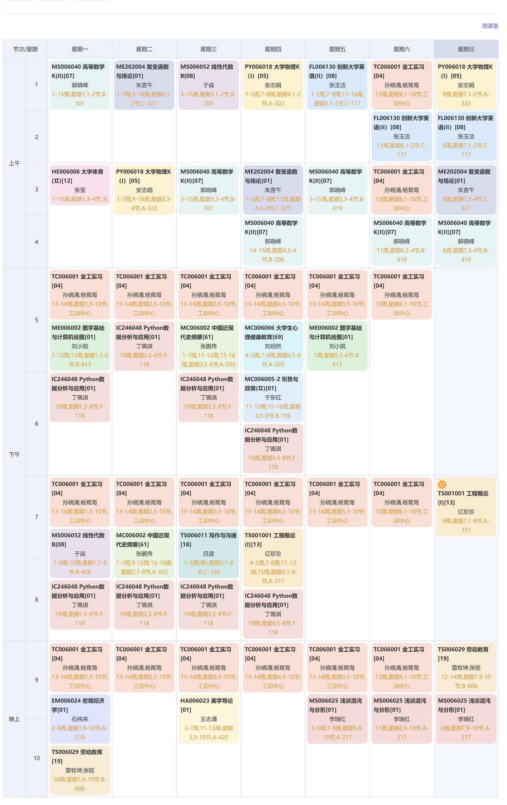
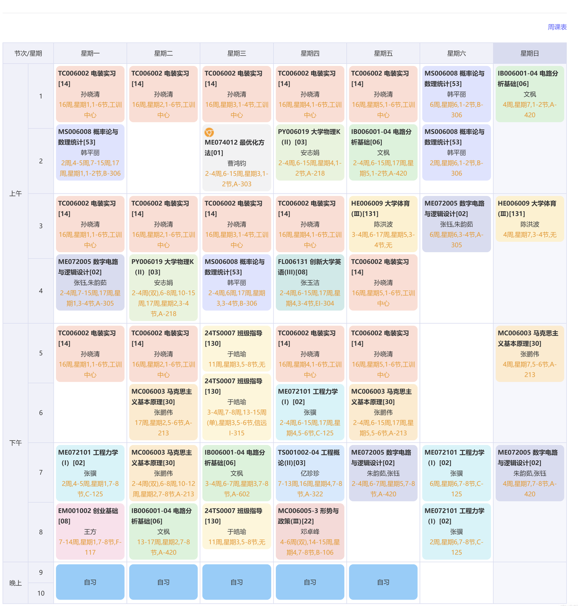
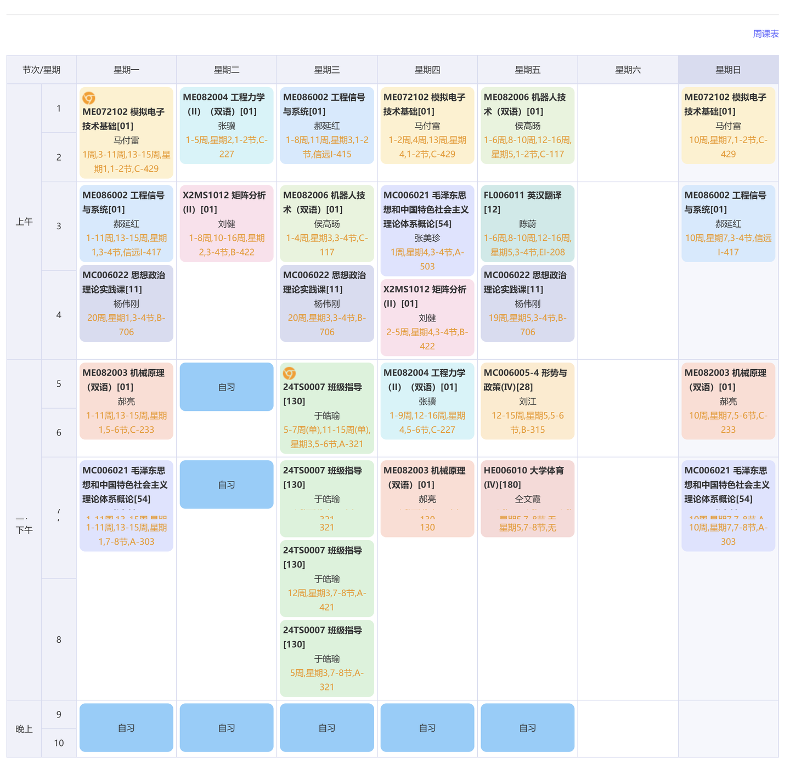
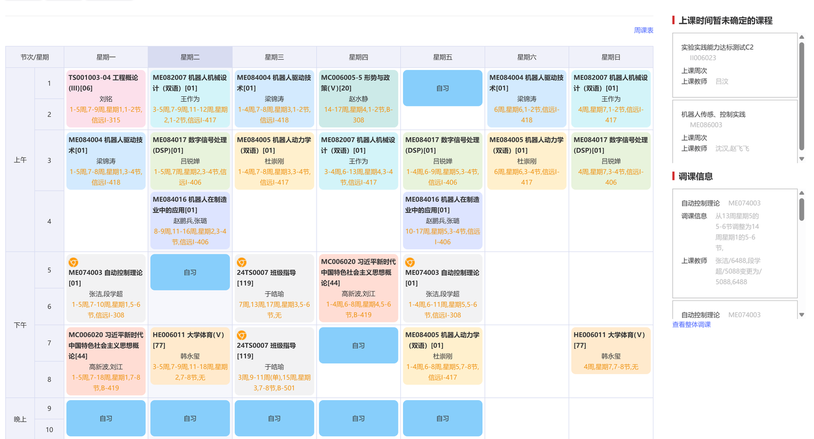
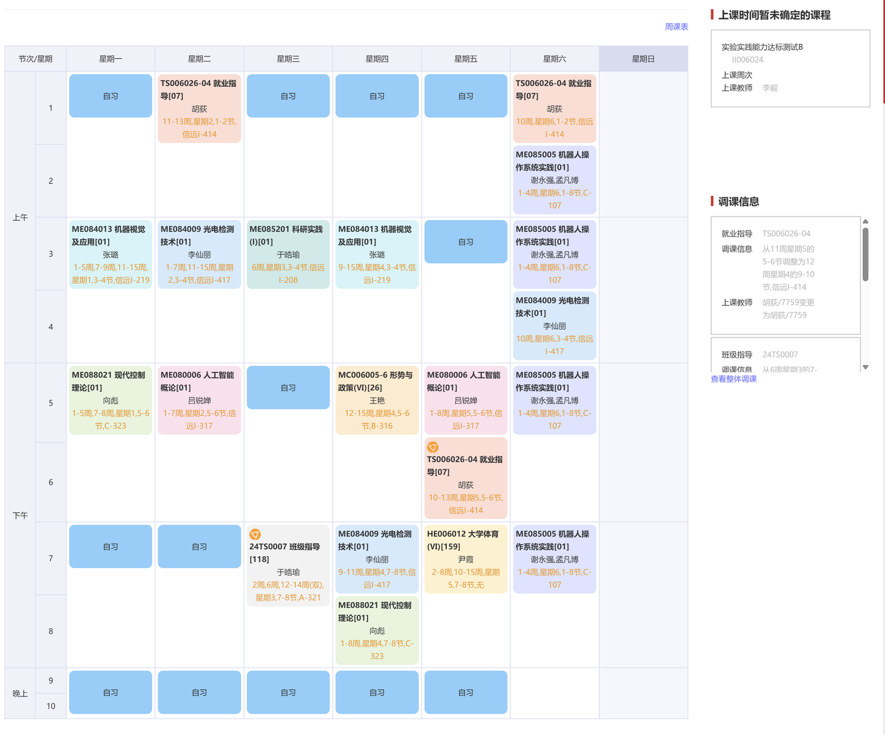

**免责声明：这篇文章不会对老师进行评价，如果想要看各个老师的评价的话，可以在微信小程序“对策府库”上查询，但是博主对小程序内的评价不持有任何意见。** 

**这篇文章可以算是[https://zhuanlan.zhihu.com/p/652836971](https://zhuanlan.zhihu.com/p/652836971)这篇文章的“机器人工程版本”（原文讲的是计科），因此部分内容如果和这篇文章有重叠，我就略过了，不方便之处还请海涵。** 

## 阅前注意

由于博主更喜欢硬卷均分，因此没有涉及竞赛和科研的内容，如果想了解这方面的内容，需移步到其他的文章。

同时，由于博主英语能力尚可，因此在自学和找参考资料的时候会用到英文教材，这一点和其他人不同。 

博主对Markdown语法尚不熟悉，阅读的时候可能会有排版错误，但内容是没有问题的。

以下是正文。

---

## 机器人工程卓越班特点和开学考

在被西电录取之后，可以关注西电的公众号或者教务处，他每年都会发布一个“实验班选拔相关情况的说明”，并附带一个表格，以2024年为例：

*2024级实验班选拔相关情况的说明*

除了除钱学森空间科学实验班（序号16）、网络空间安全实验班（序号18）选拔安排在第二学期外，其他实验班选拔均安排在新生入学第一周开展的。

如果想看这些班级有什么不同的话，可以移步开头提到的计科的文章进行参考。

而这篇文章讲述的重点就在于机器人工程卓越班，招30个人，选拔的方法就是开学考。

### 特点

2023级的机器人工程卓越班有以下特点：

- 卓越班可以用来转专业，但是真的有人会不选计科之类的而来机电吗？
- 普通班上的课程，到了卓越班可能会变成**双语课（也就是中英文混合，但绝大多数是英文）**，对英语的要求比较强。
- 比普通班上的课多一些，而且可能会有**研究生的课程搬到本科阶段** 。
- 在大二下学期和大三下学期有两次自愿退出（或者由于成绩不达标而被清出）的机会，详细说说。
- **大二下退出之后会并入机器人工程普通班进行学习，之后就和一般的班级没什么区别了，该考研考研，成绩好的该保外校保外校。** 
- **大三下退出就没有保外校的资格了，想上研只能通过考试，因此在大二下学期的时候一定要慎重考虑。** 
- 如果直到大三下都没有被清出去或者自愿退出，那么从大四开始，上的就是研一的课程，可以6年就本硕毕业（专硕学位）。

当然了，卓越班的坏处还是有的，这里我直接引用了：

> **所有卓越班限定只能保研本校，如果你想通过进试点班开学转专业但又想保研外校就要确认是否能退班，而且要注意退班后要补哪些课，在保研前来得及补不。** 
> 
> **因为是试点班，负责人可能会给你乱糊个课程体系，......普通班上的课你不上，普通班不上的课你得上，退班的时候缺的课程你得补。** 
> 
> **考试可能会单独出卷，但是最后给课程总分时不会管卷子难度不同的问题。** 
> 
> **容易招进来一批卷王，最后可能变成原本留在普通班躺着保研，但是在实验班卷成麻花最后还保不了研。** 
> 
> **保研外校时大部分实验班并不会被外校高看多少，而且实验班人基数少，卷王多容易导致名次不好看。** 
> 
> **因为人少，遇到问题容易被踢皮球，各种政策的变动可能相比普通班也会更不稳定，容易被随意拿捏。** 
> 
> **——CS_Lee** 

### 清退/选拔标准

到了大二下学期，卓越班也会进行一次选拔，没有通过选拔的同学将会被清退出实验班。

具体标准如下：

**机器人工程卓越班大二下选拔条件（2025级）：** 
1.在大二下结束之前，没有挂科的课程。如果有的话，可以补考/重修**（大二下课程除外）** ，但最后一定要及格。
2.加权均分高于80分。
3.排名位于班级内前80%。

机器人工程卓越班大二下选拔条件（2024级）：
1.（同2025级1）
2.加权均分高于80分，但若国家英语六级考试成绩优秀，可以酌情降低分数线。

机器人工程卓越班大二下选拔条件（2023级及以前）：
1.（同2025级1）
2.（同2024级2）
3.排名位于班级内前50%。

2024级并没有排名限制，这导致了一部分同学产生了松懈的心理，所以2025级又加了回去，但是阈值也放松了一些。

但同时，2025级也没有了“英语六级优秀可降低分数线”的优惠条件，加权均分必须实打实的高于80分。

### 挂科标准

西电的挂科标准如下：

1.缺勤次数达到课程学时的1/3。
**2.期末考试，卷面分低于50分。（即所谓“斩杀线”机制，是主要挂科原因）** 
*3.课程总成绩低于60分（一般很少出现）

要避免出现上述现象。

### 开学考

开学考科目是数学、英语、物理，每科都是100分满分。其中：

- **数学，英语将会作为实验班选拔的笔试依据** 。
- 不论要不要进实验班，英语的成绩高低会决定你到时候英语进的是初级班，中级班，还是高级班（学习难度自然是逐级递增，而且**初级班大一上学期不能参加英语四级考试** 。）
- 物理就不是很重要了，很多人都不去考，博主当时是去参加了，看看自己物理退化了多少（

在各类新生群和贴吧可以搜集到往年的卷子，暑假里有空可以做做，数学难度低于高考，英语约等于四级难度，但是注意英语听力要提前买一个能够收听电台的耳机（二手的也行），放听力的时候要调到相应的频率才能听，考试的时候一定不要慌。物理可能稍微难一点，不过就像前面说的那样，不是很重要。

如果你报了机器人工程卓越班，而且成绩不错，那么就会被选中参加面试，老师会问你几个机器人相关的问题，回答的自然一些就行（我记得其中的一个问题是“**你是喜欢偏硬件的还是偏软件的方向？**” ）。

## 大一上

在这个部分要强调一下选课程（主要是通识课程和体育课）的事情，这部分在我先前提到的那个计科中的文章里面有涉及，讲的很详细，我就不赘述了，核心在于要找对老师，看看评价如何，如果评价较差，那么就要注意了，如有可能就避开不选；如果是好坏参半，那么可以问问学长学姐具体的情况。

如果你被选拔进入了机器人工程卓越班，那么恭喜，你的开（niu）心（ma）校园生活马上就要开始了！先说说课程吧。

*大一上课表*

新生网上前置教育：这个一般是在开学之前就做了，老师会通知的。

新生研讨课：这个是专门会有老师来带进行实地走访，参观各种校史馆之类的地方。

化学探究实验、论语导读、视唱练耳、现代无人机系统原理与实践：这些是我自己选的通识教育课程，在期中考之后课程基本就结束了。

### 高等数学K(I)

高数已经算是老生常谈的问题了，喜欢怎么学就怎么学，市面上的学习方法，教学视频已经足够多了，这篇文章主要就是讲讲几个不一样的地方。

卓越班的高数是**K级别** 的（西电高数分档次，有K、A、B、T，各种），和普通班的区别在于卷子的最后一题不一样，更难一个档次，而且可能会考选考内容（比如广义罗尔定理）。

卓越班用的高数**教材是西电自己编的** ，一共有两本，上下册，大一上的时候发上册，大一下的时候再发下册（不是老生常谈的同济大学“小绿本”了）。

至于学习方法的话，博主当时用的是**毛纲源的《高等数学解题方法技巧归纳》（上下册）** ，这本书名气没有其他老师那么响亮，但是上手是真的好用，而且还十分详细，解题方法和技巧也非常多，美中不足就是有错别字，读到错别字部分的时候会百思不得其解。对于我而言，这本书足以支撑我的大学高数学习了。

高数是今后一切计算的基础，但是博主个人认为，死扣那些特别难搞的积分和数列也没啥意思，学完高数之后，能熟练掌握计算方法，那也就算没白学这门课了。

### 计算机导论与程序设计

这门课以C语言进行编程（C++也行），用的教材是谭浩强的《C程序设计》，但是我觉得那本书有点难啃，而且曾经被人爆出过存在部分错误，所以我个人用的教材是**《C Primer Plus》** 。考试方法是到指定的机房参加考试，在规定时间内（两个小时）根据要求进行编程并成功运行。

一定要自己练 OJ 上的题目，如果都练熟了，考试一般不难，很多人听到什么指针、结构体就发怵，但事实上考试更多的还是基本的输入输出、循环和嵌套循环、排序、分支之类的题目，而那些偏难的一般都放到最后了，而且占得分值不高，因此最重要的还是打基础，不要害怕。提交次数不会影响分数，因此你可以反复反复试。很多人考试的时候都提前离场了，我见过有人考试10分钟走人的。

OJ有些时候会抽风，比如，有些时候按照一种提交方法总是失败，按照另一种方法原封不动地提交就一遍过。这个还被同学骂过不少次，也没办法，只能等老师去修理，或者等它自己恢复。

### 思想道德与法治

进入大学的第一门思政课，没什么好说的，到了期末的时候背就完了。

有人可能会说“怎么说的那么轻松”，因为真的没有什么好讲的，很多人都是在期末的时候临门一脚，把所有知识点全部浏览一遍，囫囵吞枣去考试，然后就过了。

思政课老师会查笔记，所以还要适当的再做些笔记，当然要求也不严苛，每次上课把PPT或者书上的内容写个纲要，“甲乙丙丁，开中药铺”，也就差不多了，不必大段大段的誊抄。

### 创新大学英语

卓越班特供，对标的是英语中级班，用的教材也是独一份，除此之外就没什么好说的了，按部就班的学就行。期末考试就是做一份对标四级难度和内容的卷子。此后不再赘述。

### *其他

改革开放史同思想道德与法治，要上交笔记，但是没有期末考，最后要写一篇文章上交。根据专业或者届数的不同，上的课可能会有所变动，比如可能会变成社会主义发展史什么的。

军事理论届时可以去学校里的打印店找一份资料看看，水课。

形势与政策，大学生职业发展：水课。

## 大一下

从大一下开始，课程就多起来了，而且很多都是比较重要的科目，很多人就是在这里开始有些掉队。

*大一下课表*

实验实践能力达标测试C1-1（理工科计算机）、卓越工程实践（I）（校企联合）、学科导论、物理实验（I）未排课。

宏观经济学、美学导论、浅谈混沌与分形是我自己选的通识教育课。

python数据分析与运用是我自己选的国际双创课。

### 高等数学K（II）

同高等数学K（I）。

### 线性代数B

西电的线性代数也是分两个等级的，A和B，B偏难一点。

线性代数是之后学习机器人技术的重点知识，所以基础一定要打牢，教材也是西电自己编写的，不是同济的紫本了。但是西电自己编的书直接从矩阵开始讲，直接眼前一黑。而且零碎的定理，公式十分多，完全记忆下来是不可能且不必要的，说的功利一点，题目上有啥类型的题，你就记住那些题所运用过的公式就行了。

复习的话要认真做发的练习册，博主觉得最好的情况是能够将线性代数用可视化的方法记忆下来，这一点可以去看**3B1B的“线性代数的本质”** ，虽然和学的内容相关性弱，但是至少有个可视化的方式供人理解。

博主还用了**毛纲源的《线性代数解题方法技巧归纳》** 来辅助学习。

### 大学物理K（I）

学力学、振动与波动、热学、光学。除了力学和大二会学的“工程力学”这门科目相关之外，其他知识点用到的不是很多。

同样也是公式比较多，记得公式的推导过程当然好，但是如果实在觉得费劲，那么直接记结论即可，涉及稍高数学要求的推导和证明考试一般都不会考，以做题为导向，如果会用公式，那么就差不多了。

复习同样还是要以练习册上的题目和往年试卷真题为主，但是除了教材之外他还会发两本学习辅导（一本上册一本下册，这学期用上册），你别看它薄，它里面已经浓缩了几乎所有能用到的公式而略去了推导过程了，练习册复习的差不多了就可以去看看学习辅导。学习辅导的后面的那些题也可以做一些，如果做不出来也不要气馁，里面的有些题目还是比较难的。

### 图学基础与计算机绘图

这门课就是教你绘制图形的方法，是今后看图纸和画图纸的基础。单纯的听课多半是觉得云里雾里的，因此还是要结合配套的练习册练习。

说实话，这门课的作业是我做过最耗时间的，有些时候还会怀疑自己画的对不对，对于几何想象能力比较差的同学十分不友好。

这门课有些时候还会从练习册里面挑出几个立体结构，让你用solidworks进行3D建模，你不会？那么老师会专门让不会的同学去参加培训，然后再做。当时本人比较懒，不喜欢周末了还要跑去教学楼，所以就自学了solidworks的基本操作（比如拉伸，切割之类的，事实上，掌握这两者，很大一部分图形就都能做了），然后直接建好模提交，这样就不用去培训了。

期末考试就是考察几个基本概念（填空题），然后绝大多数都是作图，各种透视，叠加，但是老师批的还算松，如果不是特别重大的错误，基本上分都不低。

### 复变函数与场论

**2024级把这节课挪到了大二。在学完高数之后再进行学习。** 

这门课是我自大学以来上的第一个头皮发麻的课程，当时高数还没有学完，这门课就已经涉及到级数等各种知识了，听得非常困难，教材上的内容也讲的十分简略。到最后也只是草草记了几个公式，稀里糊涂的就考试了，现在想想还犹如大梦一场。

国内的教材对于复变函数的讲解，我个人感觉都不是很好，或者不是面向大学生的，因此我看的就是国外的教材：

**Complex Analysis: A First Course with Applications (Dennis G. Zill, Patrick Shanahan)** 

**注意这本书是2015年出版的第三版书，不要弄成第二版（2003年）的了。** 

这本书一方面是彩色的（蓝/灰两色），另一方面是配有大量的图片，因此可视化很强，而且还配有大量的解题示例，在做课后题的时候可以照葫芦画瓢，基本上也覆盖了这门课学习的内容。当时就是靠着这本书保命了。

### 中国近现代史纲要

同思修。

### 金工实习

很多人看到这个课表密密麻麻的全是金工实习，就很害怕，其实也还好，金工实习一般是在期末周前面的1~2个周开始的，他有好几个项目（比如铣床、数控什么的），每天做1个项目，持续两周，下午做到5点左右就下工了，最后通过各种工序，你可以得到一个自己做的小锤子，以及各种小玩意儿，还是挺有意思的。

缺点就在于每次都要写报告，费手，但是老师会发相应的参考文件的，照着抄即可。

### 卓越工程实践（I）（校企联合）

卓越班特有，这个不定时上课，具体听老师通知。

要组队自制一个小车，实现各项功能，时间跨度很长，还是比较水的。

### 实验实践能力达标测试C1-1（理工科计算机）

学期中某个时间会在班群等地方通知报名。

这门科目要上机进行考试，前半段时间是考编程（C语言），后半段时间考计算机操作（比如更改壁纸什么的）和MATLAB代码（占比不高）。如果实在不会就直接乱点，点到对的地方才会有反应（所以到了最后，一个教室里全部都是鼠标咔塔咔塔的声音）。

### 物理实验（I）

比较复杂，参见该文章开头的那篇计科文章的相关内容即可。

### *其他

学科导论、写作与沟通、大学生心理健康教育、工程概论、劳动教育、形势与政策：水课

## *大类分流——但是与卓越班无关

大一下学期结束后，普通班内的学生会开始进行分流的志愿填报，但是这个和卓越班是没有关系的，卓越班已经分流好了。

如果想了解有关大类分流的内容的话，可以移步开头那篇文章。

## 大二上

课程的量有所下降，但是还是不少，同时开始涉及进阶知识了。

*大二上课表*

军事训练，实验实践能力达标测试C1-2（理工科物理）、物理实验(II)、机构设计综合实践未排课。

### 军事训练

即军训，以前都是大一军训，疫情过后就是大二了。一般是在八月底开始的，无需多言，训就完了。

但也有人说大一会找时间军训，不太清楚。

如果觉得自己有余力的话可以去参加特殊的表演方阵或者活动，到时候评价的档次会高一些。

### 概率论与数理统计

这个就不分什么卓越班普通班了，大家都是一样的。

注意**不要轻敌** ，高中的概率论数理统计可能大家都是当送分题来做的，但是大学的概率论数理统计就很不一样了，他的各种概念都比较弯弯绕，不好理解，而且计算量比较大，一定要认真学。

复习还是用练习册进行复习，配套的还有一本学习辅导，可以拿来看看。

博主还用了**毛纲源的《概率论与数理统计解题方法技巧归纳》** 来辅助学习。（是的，博主的数学就是靠毛纲源度过的doge）

### 数字电路与逻辑设计

即数电，也是属于开头难的类型（特别是画卡诺图和化简那里，难倒一大片人），以及各种74XX的芯片。注意一开始的时候千万不要被冲垮，也没有必要去挑战特别难的题目，跟着老师的思路去解决（老师在课上一般都会讲解例题，然后让下面的同学动手做）。等学到了中后期你就会发现难度会随着你的理解深入而逐渐下降。

到了最后考试的时候老师可能会画重点，一定要记得勾画。

芯片型号不用记，要记的是每种类型的芯片的特殊的引脚。这是因为考试的时候虽说会在末尾给出芯片的图片，但是不会给出它是干什么的，这个时候就要记忆典型芯片的引脚特征了（比如计数器的结构和引脚，试卷上会画，但是不会明显的说明“这是一个计数器”）。

博主用了本国外教材来辅助学习：

**Fundamental of Digital Circuits -  A.Anand.Kumar** 

似乎是印度人编写的，和教学内容几乎重合，而且有很多新式的解题方法可供参考，缺点就是涉及的面太广了，要自己挑需要的部分来学习。

数电有实验，分为四个小实验，把课上学过的那些芯片给实地操作一遍。注意每次做实验之前要先在multisim里面进行建模和仿真，这个是算分的，当时第一次做实验的时候没注意，然后仿真的分没了，还是有点亏的。

如果学过了元器件的话实验做得就很快，不出30分钟就可以做完，如果元器件的原理都还没学，就直接让你做实验，这个时候花费的时间就长，可能一个小时左右。

### 工程力学（I）

教两方面的内容：静力学、运动学和动力学。里面有部分内容是打了星号的，那些不考。

静力学的内容和大物力学的内容差不多，只不过分析方法有区别，篇幅不多，还是比较好理解的。

运动学和动力学难度就加大了，特别是引入科里奥利力的时候容易找不着北，主要还是多做题，找解题方法。

**静力学的难点在于一般平面力系的受力分析，运动学和动力学的难点在于刚体的运动（平动+转动）** ，这两部分一定要学牢，为之后的机械原理等内容打基础。一定要好好地写课后题，课后题哪怕结果算不出来，能有模有样的写个过程，那分也不会低。

这门课有实验，分为四个小的实验。实验难度不大，就是计算比较复杂。届时会组队，听从老师安排做实验，撰写并按时提交实验报告即可。

### 电路分析基础

**2024级把这门课挪到了大一。** 

似乎从某一年开始，机电院的部分专业，电路分析和模电都被大砍了一半学时，因此曾经考的内容现在就沦为了选修内容。

同样属于“万事开头难”的科目，在这里你会涉及到很多千奇百怪的电路，初始学习的时候只有基尔霍夫电压和电流定律，根本无从下手，在之后学习了节点电压法，回路电流法等解题方法之后，这些困难情况就会明显有所缓解。

学习了电容电感后，一般电路只会出现一个这样的元器件（也就是绝大多数情况下，考的都是一阶电路），所以不用花太多心思在高阶电路上。（其实，电路分析教你的方法是**时域解法** ，**频域解法和复频域解法将会在“工程信号与系统”这门课中详加介绍** ，那个时候想要分析就方便的多了）

电路分析的最后一题一般都是比较困难的“黑盒问题”（不知道具体元器件），各种冷门的方法都有可能使用，什么叠加定理、替代定理，互易定理等等。如果没有余力了，那些题目做不出来也不用怕，把前面的题目做出来就行，最后一题同样是写过程得过程分。不过如果学有余力，一定要做一下专项训练，有些时候他出题会比较简单，如果没有掌握解题方法，丢了分，就比较可惜。

教材是学校自己出的，教辅就用学校的教材的配套教辅即可，教辅后面的模拟题是往年考试的原题，这样还可以省去买原题的钱。

这门课是模电和信号与系统的基础。

### 大学物理K（II）

同大学物理K（I）。

### 马克思主义基本原理

同思修。

### 最优化方法

这个其实是三选一的课程，就是在学期开始前，你要从三个课程中选一个学习，选了之后，另外两个就不用管了。

博主当时选这门课是因为这门课有开卷考（

其他的就没什么了，其实这门课有点水课的属性。只不过除了期末考之外，还不定时的有MATLAB机试，因此还要掌握MATLAB的相关编程能力。

### 机构设计综合实践

这门课是不定时上的，具体看老师通知。

第一节课老师会提出几个机器人的概念和应用场景，比如象鼻机械臂，爪型机械臂之类的，然后会进行分组，每个组选一个题目，进行设计和仿真，如果有能力还可以做出实物（不强制要求）。博主当时是使用了solidworks进行了设计和仿真，如果你能用其他的软件设计，还能正常运行，那也可以。

总共上三次课，第一次开题，第二次中期答辩，第三次验收（大概学期末的时候）。

### 电装实习

大体类似于金工实习，内容变成了焊接各种元器件，最后可以得到一个小型四轴无人机。

再往前几届做的是收音机，最近才改成无人机的。

### 物理实验（II）

同物理实验（I）。

### 实验实践能力达标测试C1-2（理工科物理）

这里直接引用：

> 同 C1-1 测试一样，学期中某个时间会在班群等地方通知报名，忘了到毕业前每个学期都会安排测试，注意保研要求过。
> 从几个物理实验里随机抽一个做，然后填发的评分表，有概率会抽到你没做过的实验。听起来很吓人，不过大部分到时候随机应变还是能过的，因为你哪怕做不出来评分表上很多问理论的空也能填出来，而且能带书，实在不济可以把每个实验数据都抄书上先。

### *其他

班级指导、工程概论、形势与政策：水课。

## 大二下

从这个学期开始会逐渐涉及到一些专业课，同时实践也会逐渐多起来，而且开始出现双语课。

*大二下课表*

卓越工程实践（II）（校企联合）、机器人技术基础实践未排课。

英汉翻译是我自选的高级英语选修课程。

### ！！重要提示！！

**本学期课程一律不能挂科，务必做好充分准备。** 

由于卓越班的选拔时间早于补考时间，所以大二下的所有课程都没有补考机会，一挂科就会被清出班级。同时，这学期还有很多重难点课程，有些我本人都不甚理解，所以请各位务必重视。

### 模拟电子技术基础

即模电，但是正如前所述，模电被大砍了一半学时之后，很多要学的内容都被抛弃了，现在基本上要学的就是三极管，而完全丢弃了场效应管等内容。因此难度也是下降了很多。

模电使用的教材是清华大学童诗白的，虽说很多人批评过这个教材，但是这本教材再加上配套的学习辅导，用来学习和应付考试足矣。

还是开头难，引入三极管的时候会让人感觉很难计算，如果不使用计算器的话，一道题可以折腾20分钟，之后到了直流通路交流通路的时候，如果先前的电路分析基础不牢，那么很可能就画不出通路，进而无法计算。之后的运算放大器，波形生成等内容反而不是很难，和电路分析类似。（说白了，整个模电几乎就是电路分析的进阶版，多了三极管和放大器两个元器件）

模电还要做实验，在期中之后，老师会通知某一段时间去实验室进行实验，实验仪器有限，因此先到的人先做实验。总共要做10个左右的实验，还要写报告。

模电实验不同于先前的物理实验，要格外重视一下，在实验过程中经常会由于各种各样的状况，或者仪器不足，从而耽误时间。还是有些折磨人的。

### 工程信号与系统

注意不是“信号与系统”。

全学院，乃至全校就只有机器人工程卓越班有这门课。全校伺候一个班，福分能少咯？（

开个玩笑，工程信号与系统使用的教材是吴大正编写的，这门课属于是中间难两头简单，在开始的时候，除了引入了一些新概念（比如冲激函数，离散系统）等等，大体还是属于时域分析，可以直接刻板的运用公式。但是到了频域分析，题目的难度就开始上升了，有许多零碎的公式和变换对需要记忆，很多情况都需要自己构造函数进行求解。尤其是调制解调问题，那是难想又难算（事实上，它也是考试的压轴题）。到了复频域分析之后情况又会有所好转，分析也变得方便了起来。

同样的，不会推导公式没关系，但是一定要会运用，尤其是从频域分析开始公式逐渐增多，这个时候就要特别记清楚各种性质和结论。

引用老师的一段话：

> 学生要适应目前课时紧任务重的情况，要更加重视这类有难度的课程，避免题海战、临时抱佛脚的学习方法，单纯模仿做题而没有深刻理解知识点，是学不好这门课的。万变不离其宗，首先要看懂教材、教案和例题；再做习题；针对自己不会或不清楚的问题再看教材、习题详解、MOOC和各种参考资料，进行逐个研究击破，这样才能学好。

听其他人说有的信号与系统课程有实验。机器人工程卓越班倒是没有实验，但是会有类似于大作业的东西，要你使用MATLAB进行仿真并提交报告，难度不大。

### *机械原理（双语）

**老师说这门科目从2024届开始不再开设，改为“机械设计”了，但以防万一我还是写一下。** 

令人头皮发麻的科目之二，再加上双语，就更是让人摸不着头脑了。

机械原理引入的新概念非常多，从自由度计算开始（第二章）难度就陡增，然后是四连杆分析和设计，一直到齿轮分析和设计达到难度的最高点（齿轮引入的概念特别多，公式相应的也多，部分公式还很长，比如无侧隙啮合公式），之后难度逐渐下降但还是难以让人理解。

老师所使用的教材是全英文的，如果只看英文教材根本理解不了概念，因此博主还用了另外一本中文书：

**《机械原理》 ——丁洪生、荣辉，2016年，北京理工大学出版社** 

此外，我还跟着机械原理考研**飞轮哥** 的相关视频进行了学习，就是在这样两重加持的条件下，我才得以通过了机械原理的学习和考试，真的是让人非常头疼。

在讲课的过程中，老师有些时候会说明哪些部分是重点，分值高，对于这些内容要详细记忆；而其它没有强调的，或者说明了分值比较小的，就可以略过了。

### 机器人技术（双语）

这门课类似于机械原理，老师会说明哪些部分是一定要自己记忆的，哪些部分是会给出公式或者不是考试重点，把重点记下来即可。其他的就没什么了，也是带公式，记概念。

使用的教材是**《机器人学导论（原书第四版）》——John J. Craig ** ，这本教材的有些地方是有翻译错误或者印刷错误的，但是占比很少很少，如果觉得不放心的话，可以去读原版教材**《Introduction to Robotics, Mechanics and Control, Fourth Edition》.**

### 矩阵分析（II）

卓越班独有，这门课程本来是研究生阶段上的课，被移到本科阶段了。

线性代数矩阵部分的超级进阶版，理论化太强了，听起来十分费劲。虽说老师考试的内容全部都是从书上的课后习题和PPT上的例题（其中，以PPT上的例题为主）来的，但是仍然很难计算，方法也很难掌握。而且还会考一长串的推导过程，让你写下来。

考试就是化身赌神，把能复习到的题目复习几遍，撞大运，到了考场，遇到自己复习到了的题那就好，没有复习到也罢，写点过程上去拿分。

**博主也在此道歉，这个部分确实是十分困难，没有总结出什么好的学习方法。如果有高人指点一二，那最好了。** 

使用的教材是《矩阵论（第3版）》——方保镕，清华大学出版社，好家伙1000多道课后题目，你就复习吧，谁能复习的过你呀。

### 工程力学（II）（双语）

学习材料力学的相关内容。

都说材料力学难学，但是这门课并没有专门的材料力学课程学习的那么深入，而且是在以上的一大堆难得飞起的课程里面最好学的一门了。公式虽说也多，但是不复杂，比较容易记住。更好的是，我们老师当时打印了一张带有十个空格的表格，允许我们写十个公式用作参考，因此记忆压力小于前面几个课程。

这门课到了“弯曲变形”难度会陡升，要十分注意，不要掉队了。教材本身讲解的十分详细，再加上课后题做通透，考个85往上是没问题的。

当然了，计算量会大很多，但是考试允许带计算器。

这门课程有两个实验：

1.测量铸铁和低碳钢的力学性能（弹性极限，屈服极限等等）。届时会得到一系列数据点，要画图（可以用MATLAB）并形成一份实验报告。

2.测量组合变形构件的强度。这个就按部就班的做即可。

### 毛泽东思想和中国特色社会主义理论体系概论

同思修。

### 机器人技术基础实践

这门课届时会发相关的资料，分为两个部分，同时也要提交两份报告。

第一部分是线上进行的，先组队，要求你在MATLAB上对一个6自由度机械臂进行建模并成功让其运作（也就是仿真），在此过程中会得到一系列数据（比如位姿，关节角），填写相应的**实践报告** 。

第二部分是线下进行的，要求线下组装机器人，然后填入线上仿真得到的数据，让机器人运行起来（也就是“从仿真到实现”的过程）。填写相应的**实验报告** 。

**注意“实践报告”“实验报告”不要弄混。** 

### 卓越工程实践（II）（校企联合）

和卓越工程实践（I）比较类似，只不过这次是自选主题，根据生活中的某一应用场景自己设计一个物件，写一份报告并附上相关视频提交。

### 思想政治理论实践课

这门课类似于社会实践，学校会组织组队做，最后提交调研报告。

### *其他

班级指导，形势与政策：水课。

### ！！导师选择！！

这个也比较重要，值得单独拿出来讲讲。

从大二下开始，对于卓越班的同学而言，就可以考虑寻找一位合适的导师，提前进组打工了。部分任课老师也会自荐，让同学加入自己的课题组。不过如果可能的话，还是建议先联系导师手下的师兄师姐，询问相关的情况，再决定要不要进组。如果你想找的导师刚好就是任课老师，那么你也可以根据那位老师的授课情况，形成自己的判断，决定要不要进。

至于有同学担心导师会不会看不上自己，其实不至于，你能进卓越班，能戴上“卓越班”这顶帽子，本身也说明你不会太差，大部分导师都还是认可的（但不代表你能高枕无忧，进组了也要好好学习）。

**不建议拖到大三结束了再选择导师，那个时候很多导师的名额都已经满了，竞争会比较激烈，且了解导师的窗口也会变窄，很有可能会吃信息差的亏。** 

## 大三上

*大三上课表*

实验实践能力达标测试C2、机器人传感、控制实践未排课。

### 新变化

在一轮筛选后，大三会出现很多新的变化，这里单开一章：

1.班级内人数少了很多（废话）。但是你会发现，经过筛选和自愿退出之后，班级内剩余的人数往往会小于保研名额。因此，只要你想留在班里，就按部就班认真学习即可，不用给自己太大压力，一般都没什么问题。

不过，虽然不用卷排名了，但是还是要保证自己的均分在80以上，以及不要挂科，否则还是可能会被清出卓越班的。

2.从本学期开始，部分课程就没有纸质教材了，而是换成了老师自己制作的PPT等文件。这些文件会被上传到学在西电上，但是从手机上看这些PPT/PDF多少是有点费力。

3.本学期**一部分课程会在期末之前，甚至期中就结课，结课后大概两周就会考试，而不是等到期末周再考** 。但与此同时还得上其他课，所以复习时间可能比较吃紧，尤其是对于那些比较难理解的课程。所以最好在每次学完之后再温习一遍，这样在结课后复习的过程中会稍微减些负。

### 机器人驱动技术

主要讲解各种电动机的工作原理。

没有纸质教材，取而代之的是老师自己制作的PPT。

会在期中结课。

这门课也属于是开头难，然后上着上着逐渐简单一些的课程。一开始讲“概述”的时候，就会引入很多旧的概念，公式，模块等等，很容易把各位绕晕。之后讨论到各种电动机的时候，更是有很多新的理论和概念，让人望而生畏，但是一定不要慌。

这门课程的主要考点最主要在“直流电动机”和“感应电动机”这两个部分（多数计算题也是出在这里），“步进电动机”次之，最后是“永磁无刷/同步电动机”。除了记那些计算的公式之外，这门课还有很多的新概念和新理论，而且都是专有名词，那些也要记住。

在期末复习的时候，一定要重视老师布置的课后作业，以它为基础进行复习。有很多考试题就是以课后作业为原型出的。

这门课我感觉说是专业课，更像是一门“文科”，虽说考公式和计算，但是更多的是考察各种概念和理论。还有就是PPT虽然页数很多，但是其中的知识点非常零散，散布在PPT的每个角落，所以复习的时候也不得不广撒网。学有余力的话可以试试，但是如果实在学不动了，那就以课后作业为主进行复习，基本上都考不差。

这门课有实验，在上课后一段时间，老师会发具体的实验报告材料，然后约定实验时间。总的来说还是比较好做的，实验过程中有不懂的可以问老师或者同学，实验结束后填写实验报告，打印下来，等结课考试的时候交纸质版即可。

### 自动控制理论

讲解经典控制理论。

由于学时较少，所以不会学习“根轨迹法”，算是卸了一个大包袱。

用的是西电出版的《自动控制原理（第三版）》——千博、过润秋、屈胜利、段学超。

可以说是信号与系统的“连续系统”分支的进阶版本，前几章讲的内容（时域部分），在学习信号与系统的时候都有所提及，无非引入一些新概念，主要是时域性能指标、稳定性、稳态误差，一开始学的时候应该还能接受。

但到了频域部分，难度就开始陡升了。有关奈奎斯特图的内容还比较好理解，比如奈奎斯特图的绘制，特殊点的求解，奈氏稳定判据等等。但是波特图就不好搞了，首先要学典型环节的波特图，然后要记住一些关键数值及公式（比如转折频率，二阶振荡环节最大误差公式），各种二级结论（比如计算截止频率的二级结论），最后就是绘制方法和求解方法（比如，给定开环传递函数，绘制波特图简图，或者给定波特图，反解开环传递函数）。总之，波特图这部分要尤其重视。

期末卷有三个部分，简答题，填空题，计算题，注意，没有选择和判断。

简答题是在2024年新增加的，主要是一些概念性的问题，一般集中在前两章偏概念的部分，或者是后面几章的概念部分，比如“自动控制的定义”“串联校正装置的分类和选取方法”等等。这类题目就是典型的“食之无肉，弃之有味”，说不看吧，这种题到时候卡你一下，要是没记住就白白丢分；但是说重视吧，倒也不太够格，分值比较低，一题3分或者5分，只要好好写点东西一般都有分。所以建议在复习的时候，顺手看一眼各种概念，尤其是一些重点知识的概念，但是也不用专门去背。

填空题也考概念，但是都是比较熟悉的内容，同时也会混杂一些计算，这部分比较正常。

计算题就不太好弄了，一方面是计算量非常大，另一方面是其中混杂着很多作图题（流程图化简，波特图绘制），很容易就会做不完。所以有些时候，部分难算的题目不用特别纠结（比如算相角裕量，要先算出开环传递函数的幅值表达式，然后令其虚部为0，反解频率，再代入相角表达式进行计算），跳过就行，把前面能写的能做的，先给它做了，再去专攻。

这门课确实难，但是到了最后，你会发现难的不是概念难理解，而是计算难计算，表达式难化简，这个还是和其他课有区别的，所以在复习的时候，反而会比死记硬背更轻松一些。

### *机器人机械设计（双语）

该课程从2024级开始，和机械原理合并了，但是我还是写一下。

教材是濮良贵的《机械设计（第十版）》，老师上课的时候也会展示PPT，但是是全英文的，初次学习相关知识点可能会很难理解。

会在期末前一个月左右结课。

如果说机械原理更偏理科，要你记公式和计算的话，那么机械设计就更偏文科，公式虽然也是非常零散，但是真要论起来不如机械原理，但是要记住的概念却多很多，而且也是十分零散。其中有很多的新概念和理论，比如各种零部件的主要失效形式、失效原因、改进方法等等。期末考试的判断题、选择题、问答题、甚至综合题，都是在考察抽象的概念和知识点，而且占比还特别大。

同时，由于是双语课，虽然多数题目是中文，但也会塞点英语题目，特别是一些容易混淆的概念题，本来中文就容易混淆，换成英文就更麻烦了，所以在平时还要记一下关键零部件和概念对应的英文是什么。

所以，我的感受是，在这门课上更多的是要记住抽象的概念，把概念记住了才能行稳致远。公式当然也重要，但不是主要关注点。

由于知识点实在是繁杂且零碎，博主当时用了**史瑞东的《机械考研宝典-机械设计》** 来辅助学习。别看名字是拿来考研的，但是用在课内的学习里可一点不差，这本书把大量的知识点都整合在了一起，从而避免了自己查找。注意，这里就不要用飞轮哥的教辅了，感觉不如史瑞东。

这个“综合题”听上去比较新颖，其实类似于画图题。当时考试的时候共两题，第一题是轴系+蜗轮蜗杆机构的转向、切向力、轴向力、径向力的判断，第二题是轴的改错（指出错误、给出错误原因和修改方法，不用真的动手画）。

计算题一般是从四个方面出：等寿命疲劳曲线、螺栓强度和设计、齿轮弯曲/接触疲劳强度和设计、滚动轴承设计计算。

这门课也有实验，会提前一个月发布实验材料，要事先进行打印，然后填写预习报告，预习报告填好之后才能做实验。这个实验就不太好做了，一方面是内容很多（有4个实验），另一方面是难理解，难画（算是理论课难理解的延伸），很多内容需要你自己去翻，进行推导。还有，实验室中的某些仪器似乎有点问题（比如滚动轴承实验台），可能会导致错误的结果，和理论计算对不上。这种情况下就如实填写，实际的填到“实际结果”里，理论的填到“理论计算”里，不用担心。最后，建议事先预习一下实验报告，比如有的内容可能会问具体的轴承型号，如果当时实验的时候没看清楚或者没注意看，那就完蛋了，所以在实验的时候最好预先看一遍，在做实验的时候也要对比着来找内容，以免到时候漏了某些内容，导致写实验报告的时候卡壳。

### 数字信号处理

信号与系统离散部分的进阶版本。

教材用的是西电出版的《数字信号处理（第五版）》——高西全、丁玉美

会在期中结课。

这门课听上去很唬人，但其实没有什么问题。和自动控制原理类似，开始的几章内容，比如采样定理，Z变换等，在信号与系统上都已经学过了，学起来会轻松一些。同时，前几张的内容也就是考试的重点，之后的DFT，FFT等内容，其实也比较重要，但是由于人工算起来十分麻烦，且计算机一般都能胜任，所以不是考察的重点，只需要记住一些重要的概念即可。

总之，这门课还是比较轻松的，哪怕是上学期的信号与系统没忘干净，分都不低。

### 机器人动力学（双语）

在大二下的机器人技术的动力学部分上的延伸。

没有纸质教材，而是老师制作的PPT，但也是纯英文的，同样也有初见难理解的问题。

会在期中结课。

**注意，这门课在学习的时候一定要会抗压，放平心态。** 

说是动力学，但是动力学部分只占了学习内容的一部分，更多的内容集中在控制部分，主要是线性控制和非线性控制，后期还会学力控制。

这门课程我个人感觉有些高度抽象了，且用矩阵用的很多，特别喜欢把概念推广到普适情况（比如，人工计算的时候一般就是以2自由度机械臂为主，但是学的时候，就是从n自由度机械臂开始讲的）。这导致在进行理论和公式推导的时候，经常是凭空产生了一个新概念，然后再凭空出现了一个新的“加粗字母”，然后一堆字母相互运算，还使用上了线性代数和矩阵论的相关概念和理论，最终得出了一个虽然普适，但是十分复杂，难理解的结果。

从动力学的欧拉-拉格朗日方程开始，会接触到一个重要的概念，就是动力学方程及其矩阵***D、H、G*** ，从这之后，很多的概念都是从这里出发进行推导和求解的，所以学到这部分的时候务必要理解透彻一些。

这门课有个“大作业”，具体是给一个三连杆机械臂，计算其动力学方程、在平衡点附近进行线性化、以及自行选定一种控制类型，使机械臂从给定的初始位置移动到给定的预期位置，还要绘制各种图像（位置，速度，力矩图等等）。最后一部分内容需要MATLAB进行分析，前面两个不用。可想而知，三连杆机械臂的动力学方程非常复杂，在此之上的线性化也不好做，所以要做好准备。这个大作业还要写一份论文，而且还要求必须是非常正式的那种，各种格式，公式插入，都要合乎一般论文的要求。博主当时用的是Word文档做的，其他有些同学用的是Latex或者Mathworks做的，确实更赏心悦目一些（老师也推荐后者），有条件的同学可以试试。

期末考试试卷是全英文的，有选择、判断、简答、计算四个大类。前三个也是考察基本概念，但问题在于，这个PPT是全英文的，连对应的中文概念都很难理解，更别说英文了；而且简答题也是要求全英文作答，而且会考察某些公式的具体推导过程（我们当时考的是机械臂的总动能公式的推导）。此外，这门课程也有知识点零散，分布在各个PPT页面上的问题，导致自己查找起来很费力，也得广撒网。所以还是那句话，如果学有余力的话，可以尝试通览PPT，如果学不动了，就记重点知识即可（重点知识一般是PPT里面的红色内容，或者某个重点公式/概念旁边附加的结论等等）。计算题的话，力控制不会考察计算题，当时期末考的内容是：
1.（动力学）在平面直角坐标系内，某根杆与x轴成某一角度，在平面内绕其中点旋转，求惯性张量（矩阵形式）。

2.（线性控制）对某一非线性系统进行线性化。

3.（动力学）某一个弹簧，一端固定在天花板上，另一端连接一个小球，当弹簧和竖直方向成θ角的时候，利用欧拉-拉格朗日方程求系统动力学方程。

4.（非线性控制）对于某一弹簧-阻尼-小车系统，利用两种方法证明该系统渐进稳定。（李雅普诺夫第二方法、直接求阻尼比的方法）

题外话：这门课涉及到了一点现代控制理论的内容（比如线性控制部分），下学期会深入学习。

### 机器人传感、控制实践

这门课其实在机器人普通班是一门专门的课，但不知为什么没有开在卓越班里。

分有两个阶段，理论课和实验课；每个阶段还有两个小阶段，所以我标记为理论课1，理论课2，实验课1，实验课2。时间顺序是：先上理论课1，然后理论课2和实验课1有重叠，最后上实验课2。

这门课没有专门排课，在期中之后，老师会联系班长协调时间进行上课，由于老师周内有事，所以一般是开在周末，而且一上就是一个上午/下午，要做好准备。

理论课1和实验课1是任课老师中的其中一位来带，使用的教材是《ARM嵌入式开发实例——基于STM32的系统设计》肖广兵。PPT和教材的内容完全一致。实验课是三人或者四人组队，有专门的示例代码和配套视频，每次上课都会有专门的实验目标，看着视频就可以照做，运行起来，完成目标就可以走人了。

理论课2和实验课2是另一位老师带，没有教材，用的是老师自己的PPT。实验课的话会上升一个难度，老师会让你在原有代码的基础上额外实现其它的功能，这就需要你自己会编程了。当然，不懂的还是可以问老师帮忙排查问题，一般还是没什么大碍的。

期末考试是开卷的，而且占比不大（大头都在实验上）。可以带上教材，然后把理论课2的PPT打印下来用作参考。**但是在考试之前建议要熟悉一下教科书和打印的PPT** ，上述的教科书非常厚，老师写的PPT也动辄有100页左右，如果不提前熟悉的话，考场现翻很容易找不到知识点，甚至翻错地方，白白浪费时间。

一个小技巧是：如果你看到题目比较长，那大概率是来自教科书，如果题目比较短，或者感觉“没头没尾”的，那么应该是来自PPT。但这种方法多少有点投机取巧，最好还是能直接了解知识点的大致分布情况。

### 机器人在制造业中的应用

水课。无需教材。

本来这门课应该开在大四，但是由于卓越班大四即研一，所以开在了大三。

作业就是写一篇论文，提交到学在西电上即可。

### 习近平新时代中国特色社会主义思想概论

注意，这门课程的“简答题”是带有材料的，需要你结合材料进行分析，而不是像之前的思政课一样，单纯的背诵书上的知识点就能过了。

其它没什么特别的，同思修。

### 实验实践能力达标测试C2

这个严格意义上来说有很多个考察项目可供选择，但是一般情况下，选的都是**仪器操作(I)** ，也就是示波器的操作。

这个不用慌，一般来说，在考试之前就会有人传具体示波器的操作方法，具体一步步照做即可。

该测试只有合格和不合格之分，所以做到60分就可以举手示意老师进行检查，检查好之后就可以走人了，当然，你想做到100分也可以。

### *其他

工程概论：水课。

## 大三下

这学期作为卓越班本科阶段的最后一个学期，确实会给人一种“结末”的感觉。

*大三下课表*

实验实践能力达标测试B未排课。

### 新变化

1. 先说选课问题，本学期有很多学院限选（选修）课，是以“X选一”的形式选的，在选课的时候，一定要对照着自己对应年度的机器人工程卓越班培养方案进行选课，以免多选、漏选。一般来说，在教务系统中，点击“个人方案查询”，即可看到自己的培养方案。

这里要注意，**查询的时候，会先弹出来一个界面，有时，这个界面显示的不一定是卓越班的方案，也有可能是普通班的。一定要看清楚，有“卓越班”“卓越方向”等字的才对。** 

确认无误并点进去之后，找到“专业教育课程”栏目，你就会看到有很多“X选一”分支，重点关注那些写着“【学期：3-2】”的课程（也就是大三下），从其中选一个就行。

有时，在选课的时候，你会发现有些课程分支根本没有在选课系统中提供。这种情况下，你就只能选系统中给你的课程。举例：我们的其中一个分支，是“光电检测技术”和“光信息检测与处理”二选一，但是选课系统中根本就没有提供“光信息检测与处理”，所以只能选前者。

后文讲解的时候，对于学院限选课，会说明它和哪些课互斥。但由于每届卓越班培养方案可能不同，所以仅供参考。

2.由于学院限选课没有期末考，且占比多，所以本学期的学习压力会显著下降。轻松当然是轻松不少，但是你的精力会被分到其它偏实践的任务和课程上，后文会提到一些。

3.个人认为，学院限选课在本科阶段几乎起不到实质作用，已经十分接近“水课”，它们的作用更多在于为之后自己选择的研究生方向打基础。而对于本科生，现目前能掌握初始概念和简单操作即可。因此，对于这些课，我写的篇幅也不会很多。

### 机器视觉及应用

**互斥：数字图像处理、机器人感知与学习** 

以HALCON为基础，讲解机器视觉。

使用的教材为《工业机器视觉基础教程》——郭森

这门课开头会讲机器视觉的组成和硬件部分，比如光源、镜头、相机等，以及一些理论计算公式（比如焦距等），后面大多数部分则都是在讲利用HALCON进行编程，实现图像读取、处理和识别等操作，几乎都是软件内容。

HALCON的编程语言比较独特，既不像python，也不像C/C++，它更多的是以函数为主，比如，利用某个函数实现高斯滤波，利用某个函数实现阈值分割等，所以刚开始学的时候可能会觉得不好记忆。但另一方面，等到了真正编程的时候，这些函数都不需要你死记硬背，在需要的时候去查找即可。

考查方式有两种，一种是老师在课上发一些题目，让你去完成，类型包括选择题、简答题、计算题等。大多数题目在书上都没有，所以你还是得自己去学习和理解。另一种则是在学在西电上发布编程问题，你需要提交源代码。这两种方式都是期中的时候考察一次，期末的时候再考察一次（期末这次算作结课成绩）。总体而言问题并不大。

### 现代控制理论

在自动控制理论（经典控制）和矩阵论的基础上，讲解现代控制的相关内容。

使用的教材为《现代控制理论（第三版）》——刘豹，唐万生

会在期中结课，这门课是本学期唯一一个有正式的期末考的课程。

总体而言难度也不算很大，经典的“万事开头难”，在一开始的时候会迎面撞到“状态转移矩阵”的概念，然后需要你进行求解，难度随着矩阵阶数增加而指数级增长。幸运的是，一般问题还是以二阶和三阶为主，再往上的矩阵则一般都能用巧妙的方法进行求解。后面学到能控性、能观性，及其规范型的时候，难度反而就开始下降了，无非就是一些计算。后续到了稳定性分析，这个也是老生常谈，只不过分析对象从传递函数变成了矩阵，所以就要引进一些新方法，比如李雅普诺夫第一、第二法，以及相关的公式。然后“综合”部分，难度又会开始上升，一开始是状态反馈、输出反馈、以及极点配置问题等内容，这些还好。

重点要强调的是“最优控制部分”，到这章难度就会骤然上升，一开始就会给你引入“变分”的概念，在这里很多人就有些跟不上了，然后就是“老朋友”欧拉方程（即欧拉-拉格朗日方程）。到了“哈密尔顿函数”这个地方，难度真正开始快速增长，包括规范方程（正则方程），极值条件等约束。随后又突然进入到庞特里亚金极大值（极小值）原理，这部分就基本上高深莫测，难以理解了。随后，教材提了一嘴动态规划法，然后选了“线性二次型最优控制”这个特例进行讲解，才结束。

这部分在学的时候，前面都应该认真跟上，不懂的问题要及时解决（不过应该不会有什么特别难的问题）。最优控制就要有所取舍了，几乎没人能把所有的知识都给学懂，所幸这章也不是考试中的重点。

对于期末考试，每年的规划都会有所不同，形式是填空题+简答题+计算题，**对于每个章节可能的考察情况、知识点等内容，一定要仔细听讲解，进行复习。** 

此外，虽然中间部分的知识较为简单，但不代表能一笔带过，本人在期末考试的时候，正是忘记了一般状态方程变换为能控/能观标准型的公式，导致白白丢了分，所以，哪怕一些知识点很不起眼，还是得加以记忆。

### 光电检测技术

**互斥：光信息检测与处理** 

讲解基本光学知识和光电检测技术方法。

老师推荐的教材有两个，一个是《光电探测技术与系统》——付小宁等，老师讲的内容大致是围绕着这本书来讲的，但缺点是教材比较老。另一个是《光电检测技术与系统（第4版）》——王霞等，这本就比较新，可以作为配套参考。

这门课一开始讲的是光学、热学的知识，相比于大学物理课更深入一些，属于是边复习边深入，后面才深入到光电检测技术的知识，包括各种光探测器、热探测器及其原理等内容。

博主这届的期末结课作业是需要自行去寻找前沿的光电检测系统，阅读相关论文并查找资料，然后制作一份15页左右的PPT，在课上讲解（讲解内容包括原理、性能、应用范围和未来前景等），老师根据讲解情况打分。PPT的最后还要列出参考文献，其中近几年的不能低于5篇。这个作业问题不算大，这种查找资料和读论文的过程也算是给研究生阶段打基础了。唯一需要注意的是找的内容必须前沿，博主当时讲的“光纤布拉格光栅（FBG）检测系统”，都已经算有些陈旧了。

### 人工智能概论

**互斥：智能控制导论、多传感器融合技术** 

比较杂揉，讲的内容包括神经网络、回归与聚类分析、推荐系统、决策树等等，总是都是人工智能所可能用到的相关知识点。

没有教材，主要是根据老师的PPT进行学习。

这门课的结课作业和光电检测技术类似，也是要上台，用PPT讲解和人工智能有关的概念。只不过老师会事先给你几个可选的题目和对应的PPT供你选择，如果不想选的话，你也可以自己去找相关的知识点，然后自己制作PPT去讲。

### *科研实践（I）

**互斥：深度学习与模式识别技术、机器学习、仿生结构设计** 

这门课据说从2024级开始，授课方式会进行修改，名字也会换。

这门课是实践课程，只有一节理论课。在理论课上，老师会给定一个课题，然后安排相应的分组（比如建模、硬件、算法、仿真），每个人选择一个组，然后每个组都要规划在接下来的时间中，小组的任务规划是什么，哪一周要完成什么任务、达到什么进度等等。

理论课结束之后，小组就要开始按计划推进课题。老师每周都会在固定的时间进行验收（比如每周三的某节课），查看每个小组的进度，同时要交报告。

总体而言，课程的压力还是有的，甚至在特定阶段还比较重，比如，建模组在开始的时候就要开始建模，上来就有压力；而仿真组则是前几周相对轻松，到了建模完毕，进行仿真的时候，压力就会突然提升。所以要做好准备，不要“临时抱佛脚”，导致上一个组任务都完成了，自己却一点准备都没有。至于想选哪个组，那就看自己擅长哪个方面，如果能熟练掌握SOLIDWORKS，那就去建模组；如果参加过电赛，对硬件比较熟悉，那就去硬件组，以此类推。

### 机器人操作系统实践

如课程名所言，这也是一门实践课。

主要讲解ROS（机器人操作系统，Robot Operating System）的相关知识。

在学期的一开始就会上课，且上课时间还是周末，一上就是一天，持续四周结束。

一开始也是理论课，会讲解一些基础的ROS理论知识，比如话题通信机制， Publisher/Subscriber 节点工作模式等等。后面开始也是实操了，会手把手教你安装VMware Workstation，搭载Ubuntu，以及下载对应版本的ROS。之后就是编写相关的程序让你理解理论课上所讲解的内容。

结课作业是老师会带一个小车过来，讲解相应的知识点之后，也是让你选择一个课题去做，博主这届的任务是：

1.控制小车跟踪一个特定颜色的物体，物体远了，小车要能跟上；物体近了，小车要能够后退。

2.控制小车实现避障运动。

这门课程的难度还是有的，毕竟ROS的编程语言也是和C、Python之类的常见语言不同，还得从头开始学习。但课程所打下的基础比较重要，作为“机器人工程”的学生，以后会经常和ROS这个平台打交道。

### 实验实践能力达标测试B 

这个测试也是需要选定一个项目，然后组队做出对应的实物，并撰写相关报告，线下验收。

测试也是在特定的时间会开放报名，登录进去之后会看到一些项目，比如音频放大器、变压器、万用表之类的，选择之后会下载一个文档，里面有相应的要求（以音频放大器而言，有抗噪能力，放大能力，三极管饱和情况的限制等等），做出来的实物要达到相应要求之后才有分。除了实物之外，小组撰写的报告还要打印出纸质版，在验收的时候一并提交。

这个测试考验的也是动手能力，但更重要的是仪器有些欠缺。博主当时所在小组选择的是音频放大器，实物做好之后由于没有波形发生器，导致拖了一段时间才找到仪器并验证放大器的性能，这点需要注意。

博主当时还在Multisim中搭建了对应的电路进行仿真，一同放到了报告里，这个并不是强制要求做的，但一来是验证了电路的合理性，二来也算是给报告增光了。

### *其他

就业指导、形势与政策：水课

由于班级指导和科研实践（I）都是同一位老师上的，所以基本和科研实践（I）等同。

### 生产实习

在大三下期末周结束之后进行。

对于实习，你有三个选择：

1.跟随学校统一安排，去指定的企业进行实习。

2.自己寻找一家企业进行实习。结束之后要参加答辩，证明你确实在实习。

3.用别的经历（比如电赛经历）进行学分抵扣。

对于第一条，其实也有多家企业供大家选择，老师会在学期快结束的时候将大家聚在一起，统一进行宣讲，介绍相关的企业，以及实习的安排，费用报销情况等等。部分企业的名额有限，如果人数满了的话还会调剂。届时可以根据自己的对相关企业和实习过程的兴趣，以及路程安排，离家的距离远近等因素进行选择。

这里要注意，在实习的过程中，老师会发一个实习的小册子，每次实习课程结束后，你要在其中填写相关的实习经历，心得感悟等等，这个册子将会留档，作为你参加过实习的依据。**无论你是通过什么方式进行实习（或者学分抵扣），都必须填写这个册子（哪怕是电赛，也得填写你们学了什么、做了什么），且千万不能弄丢，** 否则到时候没有实习依据就很麻烦。

## 写在最后

至此，机器人工程卓越班的“纯本科阶段”便结束了，后续除了本科课程之外，也会同步开始上研究生课程，同时还要完成相应的毕设。

本文是博主大二下学期结束的时候，刷到了计科的学长写的那篇放在开头的文章，内容确实翔实，也确实很有用，但想到机器人工程，乃至整个机电院都没有这样的文章，心中不免有些遗憾。于是心血来潮，想根据自己的经历，写一篇来自机器人工程卓越班的本科学习经验，一来为后续的机器人工程卓越班的学弟学妹，以及想要报名卓越班的同学提供一些参考，少走弯路，用尽可能少的力气得到尽可能多的成果，二来为其它专业，以及非卓越班的同学看看卓越班是个什么样，权当是“参观”，用于消遣。

当然，卓越班每年的计划都可能有所变动，这篇文章今年能用，明年可能又会有新的变化，但大的框架应该还是不会变的。

孤掌难鸣，这篇文章由我一个人写成，难免会有很多的错误以及漏洞等等，而且很多实际的内容，比如招聘、竞赛等内容，由于我个人缺乏相关经历，也都没有写上，大家也可以移步开头的那篇文章中查看。

**感谢你看到这里，祝各位学业有成！** 
